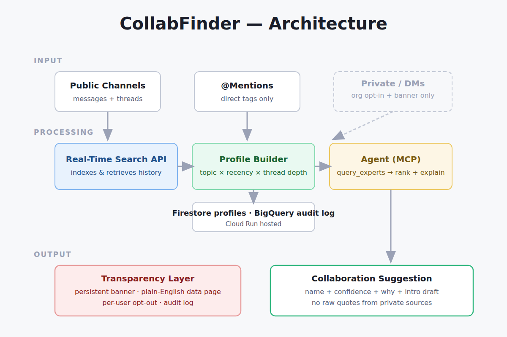

# CollabFinder

> "Who should I talk to about X?" — answered in one message.

Ambition without guidance is a path to career stagnation. CollabFinder turns public Slack
activity into a living expertise map of your organization, so nobody who wants to do well
gets stuck simply because they couldn't figure out who to pair up with.

Ask it a question, get a person — with the reason why:

```
/collab who knows about GDPR compliance?

→ Sarah Okafor (Legal Ops) — High confidence
  Why: authored 3 threads in #legal-compliance on GDPR in the past 60 days;
  most-replied-to contributor on data-retention topics.
  [Draft intro ✍️] [See more matches]
```

Built for the **Slack Agent Builder Challenge 2026** (track: Slack Agents for Orgs).

## How it works



1. **Listen** — indexes public channels and @mentions via the Slack Real-Time Search API.
   No DMs, no private channels by default.
2. **Learn** — builds per-person topic profiles weighted by topic frequency, recency decay,
   and thread depth. Thread authorship and replies *received* count more than raw message
   volume — the goal is to find who gets answers, not who talks the most.

   $$w_i = \sum_t f_{i,t} \cdot e^{-\lambda (T - t)}$$

3. **Connect** — an Agent Builder agent calls the `query_experts` MCP tool, ranks matches,
   and answers in Slack with a name, a confidence band, the reasoning, and an optional
   intro draft.

## Privacy is the spine, not a setting

The most useful version of this tool reads everything. The deployable version reads only
what it has clear permission to read — and shows its hand:

- **Public by default.** Only public channels and @mentions are indexed.
- **Org-level opt-in.** Expanded scope is a company decision, not a per-user toggle —
  and every monitored channel displays a persistent banner: *"This channel is AI-monitored
  for collaboration suggestions."* Like the light on an active webcam: if the indicator
  isn't showing, CollabFinder isn't reading.
- **Personal opt-out.** `/collab opt-out` removes you from profiling entirely, enforced at
  both ingest and query time.
- **No raw quotes.** Content from any expanded-scope source is only ever used to rank —
  never surfaced, never quoted.
- **Audit-logged.** Every read the indexer performs is recorded to BigQuery.

Plain-English data policy: `/collab privacy` links a Slack Canvas explaining exactly what
is collected, how long it's kept, who sees suggestions, and how to opt out.

## Repository layout

| Path | What it is |
|---|---|
| `seeding/` | Reproducible demo-data seeder for the Slack sandbox |
| `indexer/` | Slack reader, topic extraction, audit log — the only module that reads Slack |
| `profiles/` | Expertise weighting model + Firestore profile store |
| `mcp_server/` | FastAPI MCP server exposing `query_experts(topic, limit)` |
| `slack_app/` | Bolt app: `/collab` commands, Block Kit responses, transparency banner |
| `privacy/` | Opt-out state + transparency Canvas |
| `config/` | Org-level settings (opt-in scope, decay half-life, confidence thresholds) |
| `docs/` | Architecture diagram + submission assets |
| `tests/` | Weighting math, opt-out exclusion, ranking bands |
| `scripts/` | Cloud Run deployment |

Module-by-module detail: see [MODULES.md](MODULES.md).

## Stack

- **Slack:** Agent Builder, Real-Time Search API, Bolt (Python), Block Kit, Canvas
- **Agent:** Anthropic Claude via MCP (Model Context Protocol)
- **Backend:** Python, FastAPI, Docker
- **Cloud:** Google Cloud Run, Firestore (profiles), BigQuery (audit log)

## Running it

> Build in progress — full setup instructions land with the code.

1. Create a Slack app in your developer sandbox with scopes: `channels:history`,
   `channels:read`, `users:read`, `search:read`, `chat:write`, `commands`.
2. Copy `config/settings.example.yaml` → `config/settings.yaml` and fill in tokens.
3. Seed demo data: `python -m seeding.seed_sandbox`
4. Run the indexer: `python -m indexer.run`
5. Start the MCP server + Slack app locally, or deploy: `./scripts/deploy.sh`

## License

[MIT](LICENSE) © 2026 Michael Kernahan
